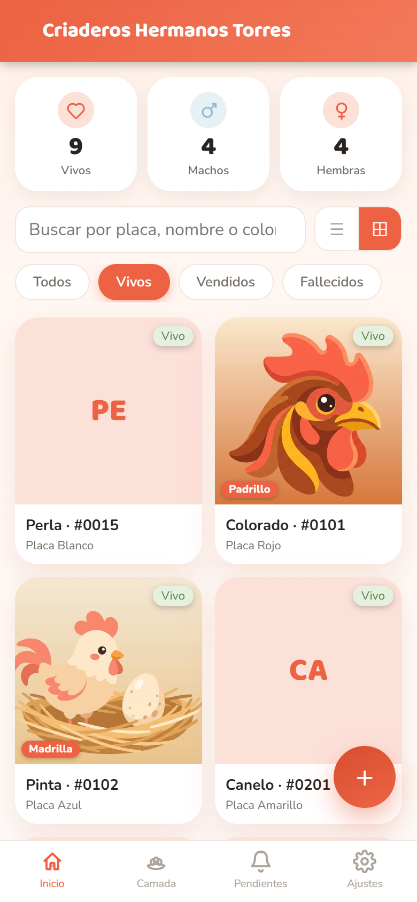
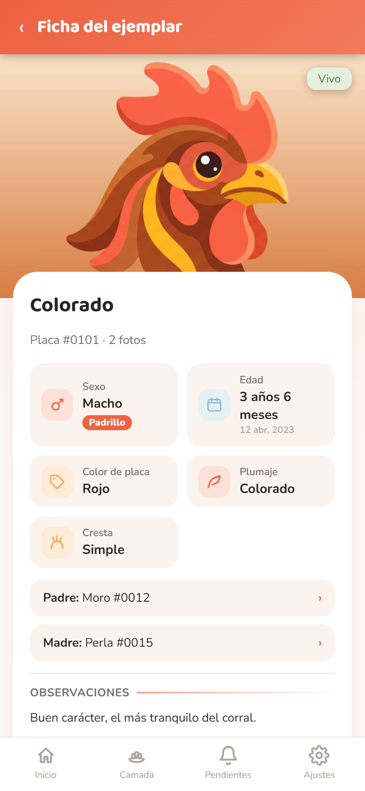
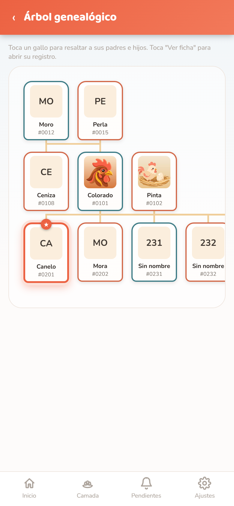
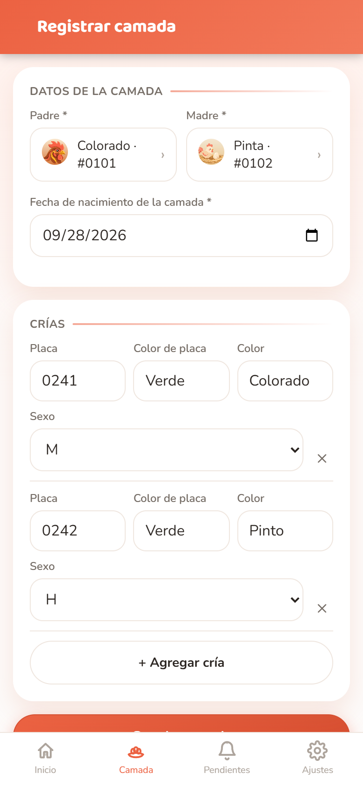

# Criaderos Hermanos Torres

Hice esta aplicación para mi papá. En el criadero, el cuaderno guardaba la historia de cada ejemplar: sus padres, las camadas, las fotos de crecimiento y las vacunas pendientes. Quería que pudiera consultar todo eso desde su celular, incluso a pie de corral y sin internet.

El cambio más importante fue modelar la genealogía con relaciones entre registros. A partir de esos vínculos, la aplicación construye el árbol familiar y permite seguir la descendencia.

**HTML · CSS · JavaScript · IndexedDB · Service Worker**

No hay cuentas ni servidor de datos. La información se queda en el dispositivo; por eso el respaldo y su restauración forman parte del recorrido principal.

[Ver el caso en mi portafolio](https://portafolio-juan-torres-puce.vercel.app/proyectos/criadero-hermanos-torres)

<p>
  
  
  
  
</p>

> Las capturas usan **datos de demostración ficticios**; las «fotos» son las ilustraciones de la propia app.

## Para quién es

Para el dueño del criadero, que la usa en su propio celular Android, a pie de corral. Por eso:

- botones grandes, una sola columna y una barra inferior con cuatro secciones;
- todo en español y con el vocabulario del criadero (placa, color de placa, cresta, padrillo, madrilla, camada);
- nada de cuentas, contraseñas ni internet obligatorio;
- se puede hacer zoom con dos dedos y se usa también con teclado o lector de pantalla.

## Qué hace (funciones reales)

| Sección | Qué permite |
|---|---|
| **Inicio** | Contadores de vivos, machos y hembras; búsqueda por placa, nombre o color; filtros Todos / Vivos / Vendidos / Fallecidos; vista en cuadrícula o en lista. |
| **Ficha del ejemplar** | Placa (única), nombre, fecha de nacimiento con edad calculada, sexo, si es padrillo o madrilla, plumaje, cresta, color de placa, padre, madre y observaciones. Enlaces a la ficha del padre y de la madre. |
| **Línea de crecimiento** | Hasta 8 fotos por ejemplar, desde la cámara o la galería. Cada foto guarda su fecha y muestra la edad que tenía el animal ese día. Se puede corregir la fecha o eliminar la foto. |
| **Estado** | Vivo, vendido, fallecido u otro, con fecha y nota. Un ejemplar fallecido **no se borra**: sigue en el árbol y en la descendencia. |
| **Camada** | Elige padre, madre y fecha una sola vez y registra varias crías de golpe (placa, color de placa, color, sexo). |
| **Árbol genealógico** | Grafo de la familia conectada al ejemplar (padres, abuelos, hermanos, hijos, nietos…; hasta 150 ejemplares), ordenado por generaciones. Tocar un ejemplar resalta sus padres e hijos. |
| **Descendencia** | Hijos, nietos y bisnietos de un ejemplar, hasta 12 generaciones, marcando los fallecidos. |
| **Pendientes** | Vacunas, fotos de seguimiento u otras tareas con fecha, ejemplar relacionado y aviso de «Es hoy», «En 3 día(s)» o «Venció». |
| **Ajustes** | Tres temas (Claro, Cálido, Oscuro); respaldo en JSON para compartir por WhatsApp o descargar; restaurar combinando o reemplazando. |

## Stack

- **HTML, CSS y JavaScript sin frameworks ni build.** Lo que está en la carpeta es lo que se sirve.
- **IndexedDB** (`js/db.js`) con dos almacenes, `ejemplares` y `pendientes`, e índice único por placa.
- **Service worker** (`sw.js`) *network-first*: con red trae siempre la versión nueva; sin red usa la copia guardada.
- **Web App Manifest** con ícono *maskable*, modo `standalone` y orientación vertical.
- Fotos comprimidas en el navegador con `<canvas>` (máx. 900 px de ancho, JPEG 72 %) y guardadas como *data URL* dentro del registro.
- Respaldo con **Web Share API** (compartir el archivo) y descarga como alternativa.
- Tipografías Baloo 2 y Nunito de Google Fonts, con caché para uso sin conexión.

```
index.html        estructura, barra superior y barra inferior
css/styles.css    estilos y los tres temas (variables CSS)
js/db.js          acceso a IndexedDB: ejemplares, pendientes, exportar e importar
js/app.js         pantallas, router por hash (#/ficha/<id>…), formularios, árbol
sw.js             service worker (caché versionada)
manifest.json     metadatos de instalación
icons/            íconos de la app e ilustraciones
pruebas/e2e.mjs   prueba de punta a punta (playwright-core)
COMO_PROBARLA.md  guía original para probarla con su usuario antes de publicarla
```

## Ejecutarla en local

Necesita un servidor HTTP cualquiera (abrir `index.html` con doble clic no sirve: el service worker y algunos permisos piden `http://localhost` o HTTPS).

```bash
# con Node
npx serve -l 5181 .
# o con Python
python -m http.server 5181
```

Luego abrir <http://localhost:5181>. Para verla como en el celular: herramientas de desarrollador → modo dispositivo → 390 × 844.

### Prueba de punta a punta

Con el servidor anterior levantado y Google Chrome instalado:

```bash
npm install          # solo instala playwright-core para la prueba
npm run prueba       # 30 comprobaciones a 390x844
```

Usa `CANAL=msedge npm run prueba` si prefieres Edge.

## Desplegarla

Es un sitio estático: sirve cualquier hosting con HTTPS (requisito para instalarla en el celular).

- **Netlify Drop** (sin cuenta, para probar): arrastrar la carpeta a <https://app.netlify.com/drop>.
- **Netlify, Vercel, Cloudflare Pages o GitHub Pages**: publicar la raíz del repositorio, sin comando de build. Funciona también en una subcarpeta (`/criadero/`), porque todas las rutas son relativas.

Después, desde Chrome en Android: menú ⋮ → **Instalar app**.

**Al publicar una versión nueva**, sube `VERSION` en `sw.js` (`"v3"` → `"v4"`). Así el celular instala el service worker nuevo y descarta la caché anterior.

## Privacidad y datos

- **No hay servidor ni base de datos en internet.** Ejemplares, fotos y pendientes se guardan en IndexedDB, dentro del navegador del celular.
- La app pide al navegador **almacenamiento persistente** para que no borre los datos si el teléfono se queda sin espacio.
- Lo único que sale del celular es el **respaldo** que el usuario decide compartir o descargar. Conviene hacerlo de vez en cuando y siempre antes de cambiar de teléfono.
- Restaurar un respaldo es seguro: el archivo se valida antes de tocar nada y la escritura va en una sola transacción, así que un archivo dañado no deja la app vacía.
- Borrar los datos del sitio en el navegador o desinstalar la app borra también el registro. Por eso existe el respaldo.

## Límites conocidos y pendientes

- Un solo usuario y un solo criadero por celular; no hay sincronización entre teléfonos (solo pasando el respaldo).
- Máximo 8 fotos por ejemplar.
- Los pendientes no envían notificaciones fuera de la app; se ven al abrirla.
- Los pendientes se marcan como hechos, pero no se pueden borrar.
- Las fechas de la camada usan el formato del idioma del navegador (en un Chrome en inglés se ven como mm/dd/aaaa).

## Historia

- **Junio de 2026**: primeras pruebas de la idea, un «cuaderno de control» en React con cuatro pestañas (pedigrí, criadero, camadas, libro) y una versión imprimible en A4 del mismo cuaderno.
- **19 al 23 de julio de 2026**: esta PWA, rehecha desde cero en JavaScript sin dependencias, con IndexedDB, fotos, árbol y modo sin conexión. Se probó con Netlify Drop en el celular de su usuario.
- **Octubre de 2026**: revisión para publicarla. Ver el historial de commits: respaldo atómico, fechas en hora local, camada que no pierde los padres, eliminar fotos, service worker v3, accesibilidad y prueba de punta a punta.

Hecha por Juan Sebastián Torres Sánchez para el criadero de su familia.
